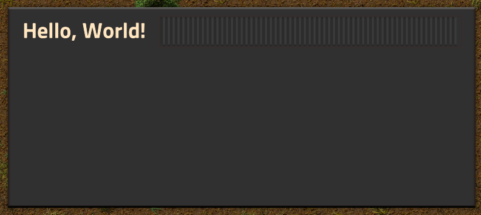
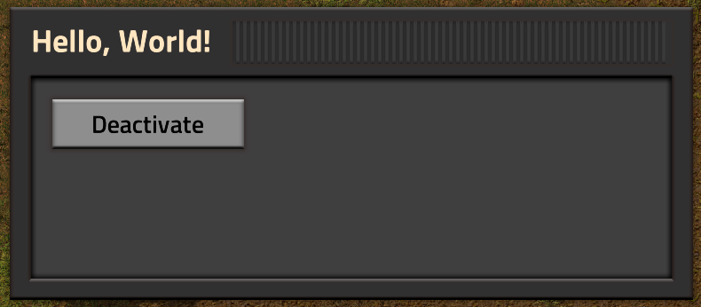
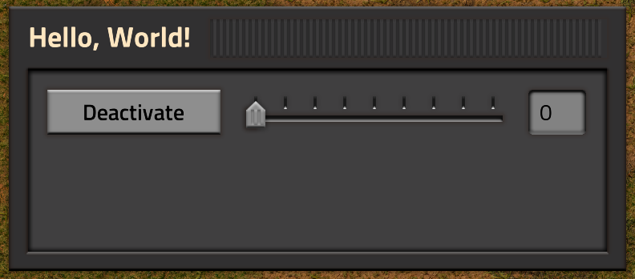
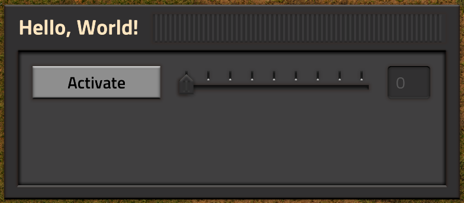
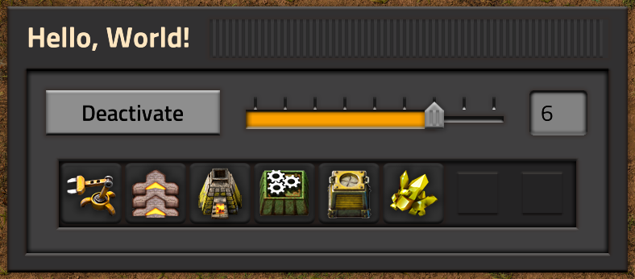
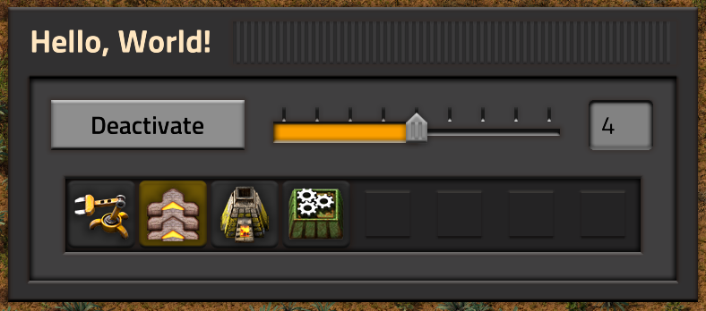

# Introduction

This is a tutorial to get you started with building a custom GUI for Factorio. It'll guide you through all the relevant steps, including the creation, styling and updating of the individual elements, and the reaction to user actions. This process is pretty involved, so please take your time. Creating custom interfaces in Factorio requires you to learn a lot of the general concepts involved in modding, so if this is your first time working on a mod, it'll take you a bit to get going.

## Before You Get Started

This guide pre-supposes that you are familiar with the very basics of modding in Factorio. If you are not, you can learn about it in the [general modding tutorial](https://wiki.factorio.com/Tutorial:Modding_tutorial/Gangsir). You don't necessarily need to go through the [tutorial mod](https://wiki.factorio.com/Tutorial:Modding_tutorial/Gangsir#The_tutorial_mod) itself, as it mostly concerns itself with data stage modding. It doesn't hurt though. [This other](https://wiki.factorio.com/Tutorial:Scripting#Saving_data_&_the_global_table) tutorial also explains events and the `global` table.

This is also neither a programming nor lua tutorial, please have a look at external resources like [this lua tutorial](http://www.lua.org/pil/1.html) instead. The tutorial also makes use of [localised strings](https://wiki.factorio.com/Tutorial:Localisation), which won't be explicitly explained. You should also be familiar with the basics of how the Factorio [global table](https://lua-api.factorio.com/latest/Global.html) works as we'll be using it to store some data.

Lastly, it is important to note that this is not a style guide. It shows you how the technical side of building a GUI works, but not necessarily which pre-made styles to use and how to properly lay out your interface. Please refer to Raiguard's [style guide](https://github.com/raiguard/Factorio-SmallMods/wiki/GUI-Style-Guide) [work in progress!] for a proper style guide after you've got the basics of this tutorial down.

## Following Along

During the course of this tutorial, we'll be building a small GUI that illustrates the concepts that are being taught. To that end, you'll find a zipped version of the mod after every chapter of the tutorial that can be used to verify the code you wrote, or to just use directly to avoid you having to put the snippets of code together yourself.

We'll be starting from a blank project that you can download [here](). It only has a basic `info.json`, a `control.lua` file that disables the freeplay intro cinematic, a `data.lua` that adds some style prototypes, and locale file that we'll be using down the line. If you're not familiar with what you see here, please refer to the 'Before you get started' section to learn more before you proceed.

## Chapter 0: Familiarizing Yourself With The Tools

Building custom GUIs is (apart from some of the styling) entirely done at runtime, meaning your code will live in `control.lua`. There are actually only three distinct classes (plus some events) of the [runtime API](https://lua-api.factorio.com/latest/index.html) that we care about.

First, there is [LuaGui](https://lua-api.factorio.com/latest/LuaGui.html), which is your jumping-off point. It is found on every [LuaPlayer](https://lua-api.factorio.com/latest/LuaPlayer.html#LuaPlayer.gui) and presents the top level elements that you'll be adding your own ones to. Especially relevant here is [LuaGui.screen](https://lua-api.factorio.com/latest/LuaGui.html#LuaGui.screen), as it's the one you'll be using the most.

Then, there is [LuaGuiElement](https://lua-api.factorio.com/latest/LuaGuiElement.html), which is the heart of the GUI API as it gives you the ability to [create](https://lua-api.factorio.com/latest/LuaGuiElement.html#LuaGuiElement.add) and modify elements. There's an overview of the types of elements that are available at the top. Don't be scared off by the wall of attributes and methods available, most of them only relate to a single type of element.

Lastly, there is [LuaStyle](https://lua-api.factorio.com/latest/LuaStyle.html), which you can use to dynamically modify the appearence of your elements. These are things like [size](https://lua-api.factorio.com/latest/LuaStyle.html#LuaStyle.size), [padding](https://lua-api.factorio.com/latest/LuaStyle.html#LuaStyle.padding) or [font](https://lua-api.factorio.com/latest/LuaStyle.html#LuaStyle.font). Be aware that some attributes that change appearance are attached to [LuaGuiElement](https://lua-api.factorio.com/latest/LuaGuiElement.html) instead for historic reasons.

In addition, you'll also be relying on several [events](https://lua-api.factorio.com/latest/events.html), notably the ones starting with `on_gui_`. These notify you of actions the user takes on your GUI elements, allowing you to react in the way you see fit. These actions can be [clicks](https://lua-api.factorio.com/latest/events.html#on_gui_click), [text input](https://lua-api.factorio.com/latest/events.html#on_gui_text_changed), or [confirmations](https://lua-api.factorio.com/latest/events.html#on_gui_confirmed).

## Chapter 1: Hello, World!

With all that out of the way, let's finally get to some actual coding. In this first step, you'll be putting a window on the screen that shows the canonical 'Hello, World!' string. If you've properly familiarized yourself with your tools, you might already have an inkling of how to do this.

The first question we'll have to ask ourselves is: 'At what point in time do we add this window?'. In Factorio, you can only do things in reaction to an event. In our case, we'll be chooing the [on_player_created](https://lua-api.factorio.com/latest/events.html#on_player_created) event. It runs, as the name implies, the first time a player starts a map or joins a multiplayer game, and only then.

This event makes sense for us, as we can just create the GUI the moment a player joins, and thus have it available from that moment on. Take note that GUIs are created for individual players, so each player needs to have their own if you want all of them to have one. There are other places where it might make sense to create a GUI, but we'll leave those for the 'Advanced Techniques'-section.

So then, let's register the `on_player_created` event. You should be familiar with how to register events, if you are not, please refer to the 'Before you get started' section to learn more before you proceed. In reaction to the event, we'll create a basic interface.

```lua
script.on_event(defines.events.on_player_created, function(event)
    local player = game.get_player(event.player_index)
    local screen_element = player.gui.screen
    local main_frame = screen_element.add{type="frame", name="ugg_main_frame", caption={"ugg.hello_world"}}
    main_frame.style.size = {385, 300}
    main_frame.auto_center = true
end)
```

At this point, it is important to note that you need to start a new map with this mod enabled for this code to run. If you load up an old save of yours, this event will not be fired, as you're already a player on it. This also means that if you make any modifications to your GUI code, say change the dimensions of the frame, you'll need to restart your map to be able to see your modifications. If you do this correctly, your screen should look something like this upon starting a new map:



There is already quite a lot happening in that short snippet of code, so we'll go through it line by line. First, you need to get the actual player object that we'll be adding the GUI to. The event only provides us with the `player_index`, not the `player` object itself, so we put `player_index` into [game.get_player()](https://lua-api.factorio.com/latest/LuaGameScript.html#LuaGameScript.get_player) and out plops our player object.

Then, we'll need to get one of the base elements that the game provides to us. In our case, we choose `screen` as it's the most versatile one of the bunch. This base element can be found on [LuaGui](https://lua-api.factorio.com/latest/LuaGui.html#LuaGui.screen), which in turn is found on the [LuaPlayer](https://lua-api.factorio.com/latest/LuaPlayer.html#LuaPlayer.gui) object we got a handle on in the previous line.

With that infrastructure in place, we can add our actual element using [LuaGuiElement.add](https://lua-api.factorio.com/latest/LuaGuiElement.html#LuaGuiElement.add). The docs for this element are somewhat intimidating, but you won't need to worry about most of the function's arguments. In our case, we just want to add a `frame` (which is the type that represents a window) with a caption/title on it. To that end, we'll call `.add` and pass a table describing the `type` of element and a localised string for the caption. If you are not familiar with how localised strings work, please refer to the 'Before you get started' section to learn more before you proceed.

We'll also give the frame a name that will come in handy later on. Be sure to prefix it with an unique identifier (`ugg` in our case) to avoid conflicts with other mods. This is only necessary for elements you add to one of the game's base elements (the ones found in `LuaGui`) as all mods share the namespaces of those elements.

Then, we adjust the appearance of our frame a bit to make it look nicer. We give it a certain width and height using the [size](https://lua-api.factorio.com/latest/LuaStyle.html#LuaStyle.size) attribute. Note that `size` is not a direct attribute of our element, but of its [style](https://lua-api.factorio.com/latest/LuaGuiElement.html#LuaGuiElement.style). You'll run into this dichotomy between [LuaGuiElement](https://lua-api.factorio.com/latest/LuaGuiElement.html) and [LuaStyle](https://lua-api.factorio.com/latest/LuaStyle.html) quite frequently, so make sure to look up where your desired property is actually located.

The last line tells our frame to automatically center itself in the middle of the screen, preventing it from hiding itself in the top left. And there you go, your first GUI element has been created. A frame with a title, and you can even move it around if you want to. It is a bit boring though, so let's address that by adding a button that can be clicked!

*You can download a snapshot of the mod at this point [here]().*

## Chapter 2: Pressing The Button

Most interfaces will want to present both data and allow to user to interact with it. To allow for this interaction, you can add control surfaces like buttons, sliders, or textfields. When the user interacts with these, the game fires the appropriate event that you'll be able to catch. We'll start simple and add a button to our frame by adding this code to the bottom of the `on_player_created` event.

```lua
local content_frame = main_frame.add{type="frame", name="content_frame", direction="vertical", style="ugg_content_frame"}
local controls_flow = content_frame.add{type="flow", name="controls_flow", direction="horizontal", style="ugg_controls_flow"}

controls_flow.add{type="button", name="ugg_controls_toggle", caption={"ugg.deactivate"}}
```

Before adding the button, we add a couple of additional elements into which we nest our actual button. These are not necessary for our button to work, but they serve a purpose nonetheless. The first one, `content_frame` has a particular style (`inside_shallow_frame_with_padding`), which is just used to make the interface look the way it should, with a lighter, inlaid square to put our content into. Then, we add another layer called `controls_flow` which we'll use later on. You can tune out those two elements for now, they aren't relevant for the button itself.

The creation of the button itself will probably seem straightforward to you now. We add an element of a certain type, with a certain caption, and we also give it a name in this instance. The prefix in the button name is necessary to be able to detect it properly in the `on_gui_click` event as you'll see very soon. Running this code should produce a window that looks like this:



Now, building an interface is cool and all, but most of the time the purpose of the GUI is for the user to manipulate data of some kind. This could be changing a preference for example. That data needs to be retained somewhere, and Factorio has just the place for you: the [`global` variable](https://lua-api.factorio.com/latest/Global.html). If you're not familiar with `global`, please refer to the 'Before you get started' section to learn more before you proceed.

For now, we'll be using the `global` table to store a single variable called `controls_active`, which represents the current state of our button. If `controls_active` is `true`, the button will show `Deactivate`, and if it's `false`, the button will show `Activate`. Why we call it *controls*_active will become clear later on.

You might remember from earlier that every player has their own set of GUIs. What follows from this is that each player needs their own set of GUI variables. You can't save `controls_active` straight to `global` because you need to make sure that every player gets their own instance of that variable. To do that, we need to give each player a dedicated table in `global`. This happens in two steps: When the mod is first loaded, we add a `players` table to `global` where our individual player tables will reside. This needs to be done [on_init](https://lua-api.factorio.com/latest/LuaBootstrap.html#LuaBootstrap.on_init):

```lua
script.on_init(function()
    global.players = {}
end)
```

This is how your code for it would normally look like. In the case of this tutorial however, the blank mod you downloaded already included a small `on_init` handler to disable the intro cutscene of freeplay. What's important to note is that you can't register for the same event twice, otherwise you'll just overwrite the first handler with the second. So in this case, you'll need to add the line `global.players = {}` to the existing `on_init` handler instead of creating a new one.

Then, for each player that joins, we need to give them their own space in that table. We have already registered the perfect event to do so: `on_player_created`, to the beginning of which we'll add the following line:

```lua
global.players[event.player_index] = { controls_active = true }
```

This does two things at once: It creates the player's table in global *and* initializes our `controls_active` variable to `true` right away. We index `global.players` with the player's index, as that is an easy and unique way to identify players, and it's also what every GUI event gives us by default.

With that out of the way, we can finally get to registering our [on_gui_click](https://lua-api.factorio.com/latest/events.html#on_gui_click) event handler. Inside that handler, we'll have the button toggle our global `controls_active` value.

```lua
script.on_event(defines.events.on_gui_click, function(event)
    if event.element.name == "ugg_controls_toggle" then
        local player_table = global.players[event.player_index]
        player_table.controls_active = not player_table.controls_active

        local control_toggle = event.element
        control_toggle.caption = (player_table.controls_active) and {"ugg.deactivate"} or {"ugg.activate"}
    end
end)
```

The first line of the handler is important, as it makes sure we're even reacting to the right event. It checks the name of the element that was clicked on, and only if it matches the one *we* created does it run its code. This check is necessary because when we register for the `on_gui_click` event, we register for *all* clicks, even the ones on other mods's GUIs.

The remaining code is pretty straightforward. We get the global table of the player whose button this is and flip the value of `controls_active`. If it was `true` before, it'll be `false` after, and vice-versa. Then, we want to change the caption on the `control_toggle` button. Thankfully, the event provides us with the element that was clicked, so we can easily get to it. We decide which of the two possible captions we'll show depending on the new value of `controls_active`. Bippity bop, we're done. We have a button that actually does something. Even if it's pretty useless for now. Go ahead and play with it. You've earned it.

*You can download a snapshot of the mod at this point [here]().*

## Chapter 3: Applying Yourself

At this point, you know how to create elements and how to hook up event listeners to them, but only barely. This chapter will apply what was shown before to a new situation, and bring up a new thing here or there. We'll add an interactive slider and textfield to give our lonely button a purpose and some company. We want to add them right next to the button, which is where our previously added flow named `controls_flow` comes in handy. Just add the following two lines to our `on_player_created` handler which add to the desired flow:

```lua
controls_flow.add{type="slider", name="ugg_controls_slider", minimum_value=0, maximum_value=#item_sprites, style="notched_slider"}
controls_flow.add{type="textfield", name="ugg_controls_textfield", text="0", numeric=true, allow_decimal=false, allow_negative=false, style="ugg_controls_textfield"}
```

The process for creating these elements is very similar to the one for our previous elements. We take a look at [LuaGuiElement.add](https://lua-api.factorio.com/latest/LuaGuiElement.html#LuaGuiElement.add) to see what arguments are needed for the desired type of element and fill them in. In our case, we want a slider and a textfield that mirror each other's value. Note that we set our textfield to only allow positive integer numbers, as that is what our slider itself represents.

The `maximum_value` of our slider is determined by the number of elements in the `item_sprites` array. We'll only use this in the next chapter, but we put it in place now. Determining the `maximum_value` depending on the size of the array instead of hard-coding it allows us to only modify the array itself, and the interface will adjust automatically.

The array itself is defined outside any events in a file-local variable. This allows us to read it from any of our events, eliminating the need to duplicate it. Be careful though: This only works for variables that you don't modify in your events, they have to be treated as read-only. Otherwise, your game will desync and crash. Any mutable data needs to be saved to `global`, as explained on the [wiki](https://wiki.factorio.com/Tutorial:Scripting#Saving_data_&_the_global_table). This is how the array is defined:

```lua
local item_sprites = {"inserter", "transport-belt", "stone-furnace", "assembling-machine-3", "logistic-chest-storage", "sulfur", "utility-science-pack", "laser-turret"}
```

Running this then code will make our little window look like this:



If you try interacting with this interface, you'll quickly notice that when you move the slider, the textfield doesn't update, and vice-versa. This is because these two elements are essentially separate in the eye of the game. They look like they belong together, but we need to implement the desired behavior ourselves. Also, our button still works as before, but it'd make more sense if we could actually use it to enable and disable the slider and textbox. Let's start by making the button do some work.

For this, we'll need to expand our `on_gui_click` handler, more specifically the part where we have actually verified that the user has actually clicked our button. We want to be able to enable and disable the slider and textfield using our button. The problem that comes up is that while the event provides a reference to the button that was clicked, it doesn't give us any other elements. We'll need to 'find' those ourselves:

```lua
local player = game.get_player(event.player_index)
local controls_flow = player.gui.screen.ugg_main_frame.content_frame.controls_flow
controls_flow.ugg_controls_slider.enabled = player_table.controls_active
controls_flow.ugg_controls_textfield.enabled = player_table.controls_active
```

This reveals why we gave every one of our elements a proper name, even if their name won't be checked against in any events: It allows us to get a reference to any element we want by following the nested structure of our interface, from the base element `screen` over frames and flows to our `controls_flow` element at last. With that, we can make one last jump to the slider and textfield and set their [enabled](https://lua-api.factorio.com/latest/LuaGuiElement.html#LuaGuiElement.enabled)-state appropriately.

Now, this approach of grappling along the element tree is kind of tedious and fragile should you decide to move any elements around at a later point. There is the alternative apporach of saving references to your important elements in `global` to easily retrieve them later, but we'll save that for an 'Advanced Techniques' topic. This stateless approach works for our purposes here.

Load up these changes and push the button. It should now disable our control elements appropriately, looking like this:



Then, we want to sync up our slider and textfield. To do that, we'll need to listen to their respective events and adjust appropriately. All the techniques used here have been shown already, so we won't go into details. Feel free to try to build it yourself first of course; it's good practice.

```lua
script.on_event(defines.events.on_gui_value_changed, function(event)
    if event.element.name == "ugg_controls_slider" then
        local player = game.get_player(event.player_index)
        local controls_flow = player.gui.screen.ugg_main_frame.content_frame.controls_flow

        local new_button_count = event.element.slider_value
        global.players[event.player_index].button_count = new_button_count

        controls_flow.ugg_controls_textfield.text = tostring(new_button_count)
    end
end)

script.on_event(defines.events.on_gui_text_changed, function(event)
    if event.element.name == "ugg_controls_textfield" then
        local player = game.get_player(event.player_index)
        local controls_flow = player.gui.screen.ugg_main_frame.content_frame.controls_flow

        local new_button_count = tonumber(event.element.text) or 0
        local capped_button_count = math.min(new_button_count, #item_sprites)
        global.players[event.player_index].button_count = capped_button_count

        controls_flow.ugg_controls_slider.slider_value = capped_button_count
    end
end)
```

The proceedure for both is similar: First, get our `controls_flow` that houses the slider and textfield elements. Then, depending on which one we are talking about, read their value appropriately, making sure to convert the string that we read from the textfield to a number using `tonumber()` and convert it back to a string using `tostring()` when putting it into the textfield. We also need to make sure to limit the `button_count` so it doesn't exceed the size of our `item_sprites` array. The slider does this by design, but the textfield doesn't. It only restricts the user to positive integers, so we'll use `math.min()` to enfore a limit/cap. We also need to hedge against the user removing the textfield number entirely, so we'll just default to 0 in that case.

You'll notice that we also saved the value of our slider/textfield to a new `global` variable called `button_count` which we'll use in the next chapter. Same as with `controls_active`, we'll want to initialize a value for that field in `on_player_created`, so we add it in the appropriate spot:

```lua
global.players[event.player_index] = { controls_active = true, button_count = 0 }
```

Now, we can play with our new control surfaces and they'll mirror each other properly. How neat is that. There are other things that we could add to make the interaction even cleaner, like making sure the textfield always shows a number that's within the range of the slider, but for this tutorial we'll stop here.

And that's it for this chapter, hopefully it has made you more confident in how to build interfaces and handle their events. In the next chapter, we'll be expanding our interface with a variable amount of buttons and learn how to best deal with such a situation.

*You can download a snapshot of the mod at this point [here]().*

## Chapter 4: Putting Sprites Into Buttons

Our goal in this chapter is to put a row of sprite buttons into our interface, each showing one of the item sprites we listed in our `item_sprites` table. In addition, we want to allow the user to choose how many of those buttons are shown to them. Lucky us, we already have the infrastructure in place to do this! Our 'slider and textfield'-combo does exactly this, and even saves the result to `global`.

Creating these buttons will require a somewhat different approach to what we did previously though. We can't just statically create those buttons as we'll need to take into account how many of them should be shown, and even adjust in reaction to user input. A popular approach to this problem is to, at the moment the desired amount of buttons changes, remove all the existing buttons and recreate the exact ones you need. This 'pave and rebuild' technique is pretty basic, but it's also simple to implement and reduces the complexity of your code quite significantly in some cases, even if it does cost some performance.

In this particular example, we could for example just go through the buttons and make the ones we don't want to show invisible. That would be simpler and better for performance. What this section is meant to illustrate though is how this approach works in general, because it will be your choice in certain situations. Imagine that you have these buttons, but you'd also need to adjust their style, sprite, tooltip and order. That is a ton of specific code to adjust your buttons, most of which will be very similar to the code you wrote for the initial construction of the buttons. It's vastly simpler to just delete all of them and just let the original code that builds the buttons do its job.

If that all sounds a bit confusing to you, maybe the implementation will make more sense. We'll start by laying the foundation for our row of buttons in `on_player_created`:

```lua
local button_frame = content_frame.add{type="frame", name="button_frame", direction="horizontal", style="ugg_deep_frame"}
button_frame.add{type="table", name="button_table", column_count=#item_sprites, style="filter_slot_table"}
```

This code creates a frame with a particular style, into which we layer a table that'll be home to our eventual buttons. You'll often encounter this type of layering of containers when creating GUIs, as it's often used in combination with particular styles to achieve a certain optical effect. Here, it's creating a dark inlaid box, similar to the player's main inventory.

We can do this part alongside the rest of our interface because it'll remain static. We'll always need a box to put our buttons into; That doesn't change, even if the buttons themselves will. Now comes the trick though: We'll use a function to build the buttons themselves. The call to the function gets put right after we create the button box in `on_player_created`:

```lua
build_sprite_buttons(player)
```

The function will be a file local one, as our intention is to call it from more places than one. This has an influence on how we structure the function, and we'll see why shortly. Let's go through it first though:

```lua
local function build_sprite_buttons(player)
    local button_table = player.gui.screen.ugg_main_frame.content_frame.button_frame.button_table
    button_table.clear()

    local player_global = global.players[player.index]

    for index, sprite_name in ipairs(item_sprites) do
        if index > player_global.button_count then break end

        button_table.add{type="sprite-button", sprite=("item/" .. sprite_name), style="recipe_slot_button"}
    end
end
```

The first order of business is to aquire a reference to the table we want to put our buttons into, similar to what we did before. Once we have that, we need to [clear()](https://lua-api.factorio.com/latest/LuaGuiElement.html#LuaGuiElement.clear) it, which removes any elements that the table contains. The first time this function is called, there will obviously not be anything in it, but that's fine. This is just here when we call the function to apply our 'pave and rebuild' technique.

Then, we'll need to extract the number of buttons the user wants from `global`, which is thankfully quite easy. This right here is one of the main reasons we want to save that number in `global`. It allows us to call this function from anywhere at any point, without needing to give it any parameters except the `player`, and it can gather what it needs itself. This makes this a very easy interface as just adding a simple function call anywhere without any preparation will do the trick.

Finally, there's the actual construction of the buttons. We loop through our list of sprites that we want to show, while making sure we respect the limit the user set with our `break` condition. Adding a GUI element has become routine by now, we configure a type, a sprite for our button (which needs to be [formatted](https://lua-api.factorio.com/latest/Concepts.html#SpritePath) by prefixing `item/`), and an appropriate style.

Now that we have this handy function, all we need to do is to make sure that we call it when the desired amount of buttons changes, which is at the end of both the `on_gui_value_changed` and `on_gui_text_changed`. Go ahead and add the function call from above to both of those, then load these changes and play with the slider. It should look like this:



The buttons will pop in and out of existence as you move the slider. Isn't that satisfying. What's also satisfying is how these buttons will come in useful in the next chapter, illustrating how to work with a variable amount of same-ish buttons.

*You can download a snapshot of the mod at this point [here]().*

## Chapter 5: Tagging Your Buttons

These pristine buttons are pretty, but don't actually serve any purpose yet. Kind of a problematic situation for something the user is supposed to push. Let's give them something to do, and even learn a thing or two along the way.

What we're going to do is pretty straightforward: We'll let the user select one of the buttons by pressing them. The selected button is highlighted in yellow, the others remain as they are. There can only be one button selected at once. At the beginning, no button is selected.

What we need for that is another global variable to store the name of the currently selected item in. We'll call it `selected_item` and it'll start off as `nil`, meaning nothing is selected at first. So, we expand the global table initialization we do `on_player_created`:

```lua
global.players[event.player_index] = { controls_active = true, button_count = 0, selected_item = nil }
```

Then, we need to make sure that the buttons reflect their selected-ness properly. We do this in the function that builds our buttons, by checking the content of our global `selected_item` variable and assigning the appropriate style. Update the `build_sprite_buttons()`-function by adding the style-decision variable `button_style`:

```lua
local button_style = (sprite_name == player_global.selected_item) and "yellow_slot_button" or "recipe_slot_button"
button_table.add{type="sprite-button", sprite=("item/" .. sprite_name), style=button_style}
```

Now, we get onto the part where we react to the user clicking on a button. Should be similar to what we do with our activation button, right? Not quite, I'm afraid. The issue is that there's a variable number of buttons, and we need to be able to distinguish them in our on_click event. In this particular case, we *could* read the sprite on the button that's clicked and determine which one it is that way. That kind of approach will not work in every case though, so in the context of this tutorial, we'll use a more generic one: [tags](https://lua-api.factorio.com/latest/LuaGuiElement.html#LuaGuiElement.tags).

[Tags](https://lua-api.factorio.com/latest/Concepts.html#Tags) are a simple way of attaching primitive lua values to any GUI element. We can use them to add any kind of identifying information to our element, which is incredibly useful. Note that tags were only added with [Factorio 1.1](https://wiki.factorio.com/Version_history/1.1.0#1.1.0), so many older mods don't use them. The go-to way to store this information was to concatenate the data into a string and use it as the name of the element. This older approach is not recommended practice anymore, you should definitely use tags. Just know that when you look at other mods, there is a reason why they cram so much data into the element name.

Tags are really simple to use, you just set them when creating the element. In our case, we just need a tag that contains the name of the item that the button represents. We give the tag a name (just `item_name` in our case) and associate the appropriate value to it. In addition, we add a tag called `action` that tells our event later on which kind of button this is in general. So, we add these two tags to our button creation as follows:

```lua
button_table.add{type="sprite-button", sprite=("item/" .. sprite_name), tags={action="ugg_select_button", item_name=sprite_name}, style=button_style}
```

There's two more things that are important to note here. First, we couldn't use the exact same name for all of our buttons, ie. all give them the `ugg_select_button` name. The game doesn't allow two elements with the same parent to have identical names, as that would obviously break our ability to index them by name. So we need to put that `name` into a tag as well, which is just as valid. Second, we used the `action` moniker to indicate which group this button belongs to. This is by no means an entrenched convention, you can use any format for this you like. Just make sure that it doesn't collide with other mods' usage of tags, as again, your `on_gui_click` event fires for any mod's button, not just your own.

Finally, we can get to the event handler itself, which is mostly straightforward. As we already have an `on_gui_click` handler, we can't add a second one, as that would override the first one. We need to expand our existing handler. Below is the whole, updated handler, with some of the unchanged code left out:

```lua
script.on_event(defines.events.on_gui_click, function(event)
    if event.element.name == "ugg_controls_toggle" then
        [ ... ]
    elseif event.elements.tags.action == "ugg_select_button" then
        local clicked_item_name = event.element.tags.item_name
        global.players[event.player_index].selected_item = clicked_item_name

        local player = game.get_player(event.player_index)
        build_sprite_buttons(player)
    end
end)
```

After making sure we react to the right event, we first extract the item-name of the clicked element from the `tags` we attached previously. Then, we save that to our `selected_item` variable we added to `global`. Lastly, we use our handy `build_sprite_buttons()`-function to refresh the list of buttons to reflect the new situation. Note how having a single function that refreshes our buttons saves us a bit of effort here. If we didn't have it, we'd need to manually iterate over the exisiting buttons, compare their tags and update the style accordingly. If you did everything right, your GUI will look something like this:



Now you know how to work with a variable amount of elements and how to use `tags` to your advantage. We only saw one use for `tags` here, they can be useful in many other situations a well, so don't hesitate to use them if you think they'd be useful. This was the last chapter that adds more functionality to our little interface. In the following two, we'll focus on some of the supporting infrastructure that is needed to create an interface that feels native to the game.

*You can download a snapshot of the mod at this point [here]().*

## Chapter 6: Making Things Nice

- Note that when using `on_player_created` to build GUI, you also need to do the same `on_init`
- Move creation to a new function and use global to initialize GUI
- Use hotkey/shortcut to toggle interface, that also builds it implicitly
- Respond to `on_gui_closed` and set `player.opened`

[...]. In the next and final chapter, we'll learn how to properly migrate your interfaces, which is important should you ever want to release an update to your mod.

*You can download a snapshot of the mod at this point [here]().*

## Chapter 7: The Big Migration

- Deleting interface on `on_config_changed` so it incorporates updated code
- Save references to important elements in global, remove those too though `on_config_changed`
- Also remove everything `on_player_removed`

And that's it for the chapterized part of this tutorial. If you took all these lessons to heart, you should be able to make some proper interfaces for your mod. There is however a loose collection of advanced topics related to creating GUIs in Factorio. They are not strictly necessary to know, and only relevant in specific situations, but maybe you'll be in need of one of them at some point. Feel free to take a look.

*You can download a snapshot of the mod at this point [here]().*

## Topic: Looking For Inspiration

- Look at vanilla or mod interfaces to see the layering and styles used (Ctrl+F5/F6)
- Look at other well-done mods' code to see how they do things/lots of 'correct' approaches
- Look at Rai's style guide
- Ask on the Discord

## Topic: Style Prototypes

## Topic: mod-gui

## Topic: Manipulating Vanilla GUIs

- Can't manipulate directly, but can do two things: entirely replace, or add relative elements